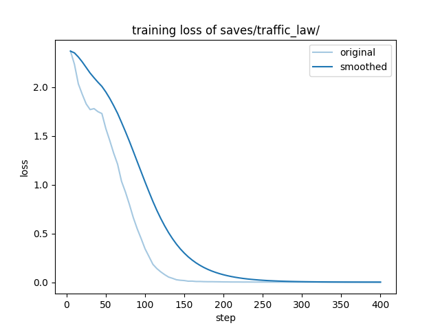
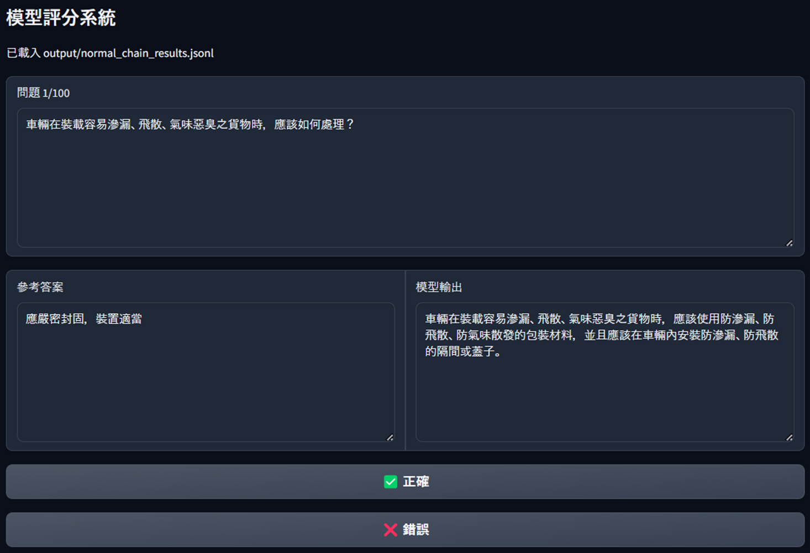
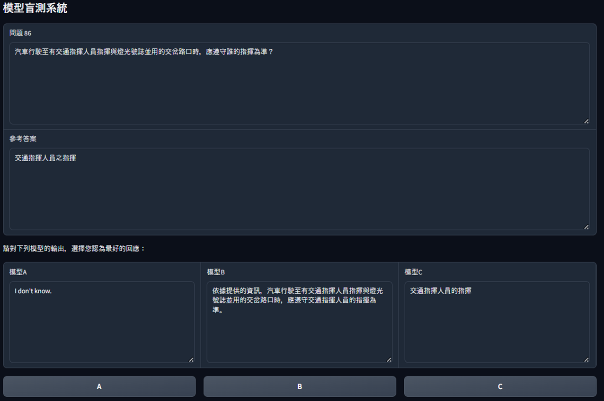

# RAG (Retrieval-Augmented Generation) Experiment

This is a small experiment on RAG versus finetuning. I use a domain-specified data to compare the benefits brought by RAG and finetuning.

## Environment
To set up the environment, use the following commands:
```
python -m venv env
. env/bin/activate
pip install -r requirements.txt
```

## Data
The data I used is [**道路交通安全規則**](https://law.moj.gov.tw/LawClass/LawAll.aspx?pcode=K0040013), one can find the merged pdf file in `data/道路交通安全規則.pdf`.

## Synthetic Data
The raw data is not suitable for training, so I use `gpt-4o` to generate synthetic data for training and testing. The prompt I use can be found in `generate_data.ipynb`.

> [!warning]
> To use OpenAI API, create a file `key.py` and paste your key as below:
> ```
> API_KEY = {your_api_key}
> ```

## Finetune
I use the synthetic training data (`data/train_alpaca.jsonl`) to training the model. 

The following hyperparameters were used during training:
- learning_rate: 5e-05
- train_batch_size: 4
- eval_batch_size: 8
- seed: 42
- distributed_type: multi-GPU
- num_devices: 8
- gradient_accumulation_steps: 8
- total_train_batch_size: 256
- total_eval_batch_size: 64
- optimizer: Adam with betas=(0.9,0.999) and epsilon=1e-08
- lr_scheduler_type: cosine
- num_epochs: 100.0

The training loss plot is as below:


## RAG (Retrieval-Augmented Generation)
To implement RAG, I use [🦜️🔗 LangChain](https://github.com/langchain-ai/langchain) as the framework.

For the implementation details, please refer to `main.ipynb`.

## Result

One can see that using RAG can improve the accuracy up to 71%, which is higher than using finetune by 20%.


- `finetuned_{ckpt}`
Here I use `200`/`400` as the checkpoint number.
- `RAG_{embedding_model}`
Here I use openai(`text-embedding-3-small`)/huggingface(`all-MiniLM-L6-v2`)

## Rating System
To score the output of each model, I made a small website to better judge the output. To activate the webui, use the following command:
```
python gradio/scoring.py
```



Another rating system I built is `blind-test system`. It is used to blind-test the output of the three models. Use the following command to run the webui:
```
python gradio/blind_test.py
```

